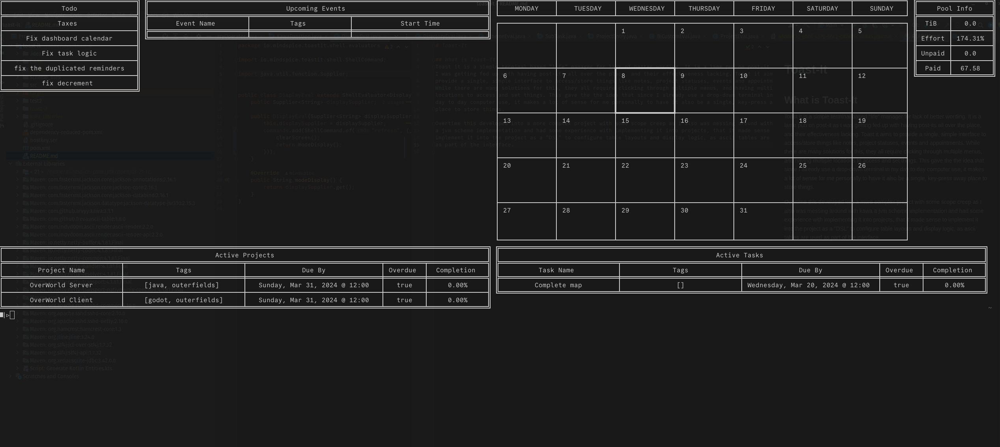

# Toast-It

## What is Toast-It
Toast it is a simple terminal based "life" manager for lack of better wording. It is a lame pun on post-it as
I was getting fed up with having post-its all over the place, and their effectiveness lacking. Toast it aims to
provide a single, simple interface to access/store things like notes, project statuses, events and appointments.
While there are many solutions for this, they all require clicking through multiple menus, and having multiple 
locations to access and set things. This gave me the idea that since I already use a drop-down terminal in my 
day-to-day computer use, it makes a lot of sense for me personally to have it also be a single, key-press away
place to store things.

Overtime this developed into a more complex project with some scope creep as I also was messing around with kawa
a jvm scheme implementation and had some experience with implementing it into projects, that it made sense to
implement it into the project as a "DSL" to configure table layouts and display logic, as ascii tables are used
as part of the interface.





## Status
While I currently use this for note storage and keeping track of appointments, it still needs some more work that
I haven't found time to complete. There is a bug with event notifications, where they will get issued multiple times
, as well as some small bugs like completion percentages for projects not showing in the ui and a few other ui related bugs 
that while small need to be debugged against it running with some test data. I also need to add some through documentation
on how to configure everything via the scheme files, and the static fields they are setting in the config. While I 
am proud of the end result, the project scope crept up on me and I had to move on to other projects for a while.

## Configuration

The main config file is scheme_files/config.scm, which is executed by init.scm which is executed first, 
followed by post-init.scm. Init defines some aliases and loads config, while post-int is called after some
other internal initiation happens with the scheme interpreter set up . 
There are some default dashboards like calendar, event, task and notes which are set via the config files calls that
set the static variables of the config file.

Ex: ```(set-static Settings `TASK_REFRESH_INV_MIN 240)```

The table-config.scm file set up the size, columns and data transformations for the various dashboards and post-init.scm
needs to be called. post-init sets up the default "ShellModes" which are defined in java, but there is the ability
to also define custom ShellModes directly in scheme though this isn't documented yet.
